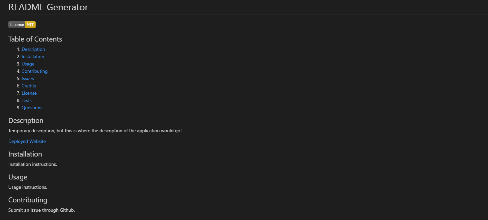

# README Generator

  

  ## Table of Contents

  1. [Description](#Description)
  2. [Installation](#Installation)
  3. [Usage](#Usage)
  4. [Contributing](#Contributing)
  5. [Issues](#Issues)
  6. [Credits](#Credits)
  7. [License](#License)
  8. [Tests](#Tests)
  9. [Questions](#Questions)

  ## Description

  This is where the description of the project would go!

  [Deployed Website](https://github.com/ashleyaggie/READMEGenerator)

  Example picture:

  

  ## Installation

  Install instructions.

  ## Usage

  Usage instructions.

  ## Contributing

  How users can contribute to the project.

  ## Issues

  How to report issues with the project.

  ## Credits

  List of collaborators and/or third-party assets.

  ## License

  Copyright Ashley Wright 2021

  This is covered under the <a href='https://opensource.org/licenses/MIT'>MIT</a> license.

  ## Tests

  None

  ## Questions

  Feel free to contact through the following with any questions:

  Email: ashleyaggie@aol.com

  Github: <a href='https://github.com/ashleyaggie'>ashleyaggie</a>