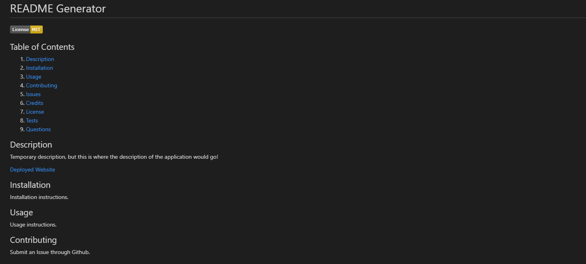

# README Generator

  

  ## Table of Contents

  1. [Description](#Description)
  2. [Changes Criteria](#Changes)
  2. [Installation](#Installation)
  3. [Usage](#Usage)
  4. [Contributing](#Contributing)
  5. [Issues](#Issues)
  6. [Credits](#Credits)
  7. [License](#License)
  8. [Tests](#Tests)
  9. [Questions](#Questions)

  ## Description

  In this assignment, we were tasked with creating an application in which the user answers multiple questions and the answers are then used to populate a README.md file. This is the first time I've used a Table of Contents, and honestly prior to this I forgot you could make one!

  This was an interesting test in seeing how far the capabilities of a Markdown can go, and how using different functions and JavaScript files work together to create a cleaner application. I originally was just working in the index.js until I found the generateMarkdown.js and at first, I got really tripped up by it. After I figured out how to make the prompts from Inquirer flow correctly and utilize the generateMarkdown functions, I felt a lot better about it. I did wind up changing some arguments in the functions, because I felt they flowed better with the process I wrote.

  Unable to be deployed.

  [Link to video demonstration](https://drive.google.com/file/d/1IHlTkSWuQuvep4m9N7t2l_ceNzmkauwC/view)

  [Example README](./README.md)

  Example picture:

  

  ## Changes

  GIVEN a command-line application that accepts user input

  WHEN I am prompted for information about my application repository

  THEN a high-quality, professional README.md is generated with the title of my project and sections entitled Description, Table of Contents, Installation, Usage, License, Contributing, Tests, and Questions

    * Title, Description, Installation, Usage, License, Contributing, Tests, and Questions part of prompts.
    
    * Table of Contents is added automatically.

  WHEN I enter my project title

  THEN this is displayed as the title of the README

    * Title is asked for in prompt.

  WHEN I enter a description, installation instructions, usage information, contribution guidelines, and test instructions

  THEN this information is added to the sections of the README entitled Description, Installation, Usage, Contributing, and Tests

    * Added to the README by using the generateMarkdown function provided with the response data.
    
    * Then the generated content is given to the writeToFile function in index.js.

  WHEN I choose a license for my application from a list of options

  THEN a badge for that license is added near the top of the README and a notice is added to the section of the README entitled License that explains which license the application is covered under

    * Given a list of available license options taken from choosealicense.com.

  WHEN I enter my GitHub username

  THEN this is added to the section of the README entitled Questions, with a link to my GitHub profile

    * Prompted for github username and added using the generateMarkdown function into an anchor tag.

  WHEN I enter my email address

  THEN this is added to the section of the README entitled Questions, with instructions on how to reach me with additional questions

    * Prompt for email and added using the generateMarkdown function.

  WHEN I click on the links in the Table of Contents

  THEN I am taken to the corresponding section of the README

    * Created using square brackets for the name and parenthesis for the link to the section name.

  ## Installation

  Files must be downloaded from Github. Then, run npm install to get the necessary node modules. Last, run node index.js.

  ## Usage

  As mentioned in the Description, this is an application in which the user answers multiple questions in the terminal and the answers are then used to populate a README.md file.

  ## Contributing

  For contributions, please create a fork to work out, then, when done, create a Pull Request.

  ## Issues

  Submit an Issue through Github for any bugs or problems.

  ## Credits

  Licenses are from choosealicense.com.

  Badges are from <a href='https://gist.github.com/lukas-h/2a5d00690736b4c3a7ba'>Lukas-h Github</a>.

  ## License

  Copyright Ashley Wright 2021

  This is covered under the <a href='https://opensource.org/licenses/MIT'>MIT</a> license.

  ## Tests

  None

  ## Questions

  Feel free to contact through the following with any questions:

  Email: ashleyaggie@aol.com

  Github: <a href='https://github.com/ashleyaggie'>ashleyaggie</a>